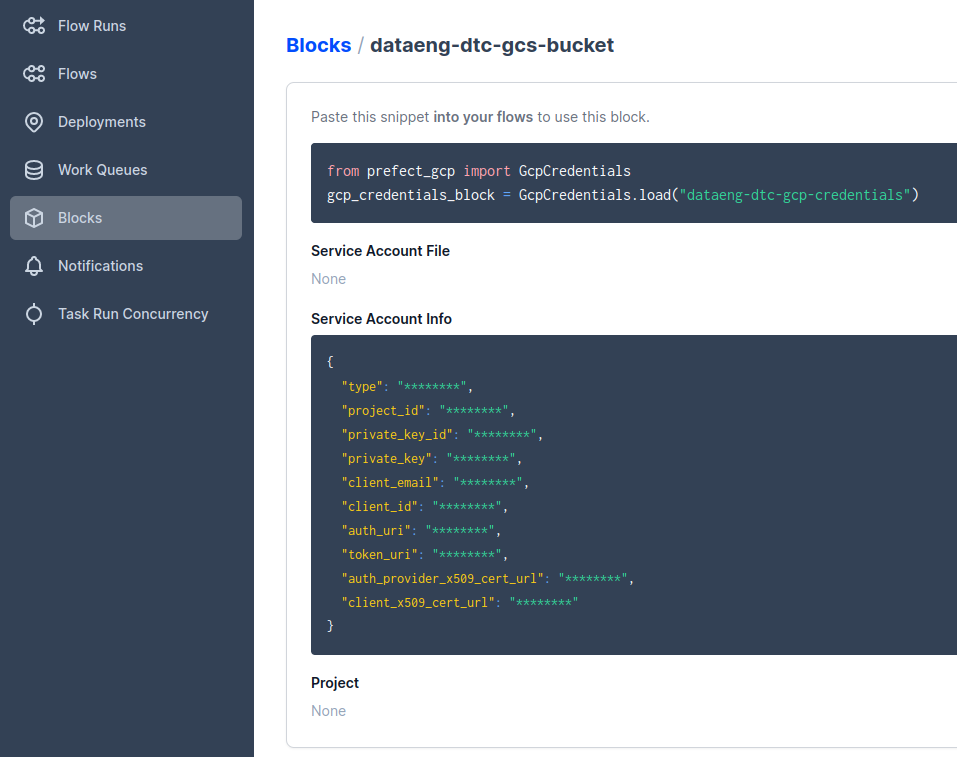
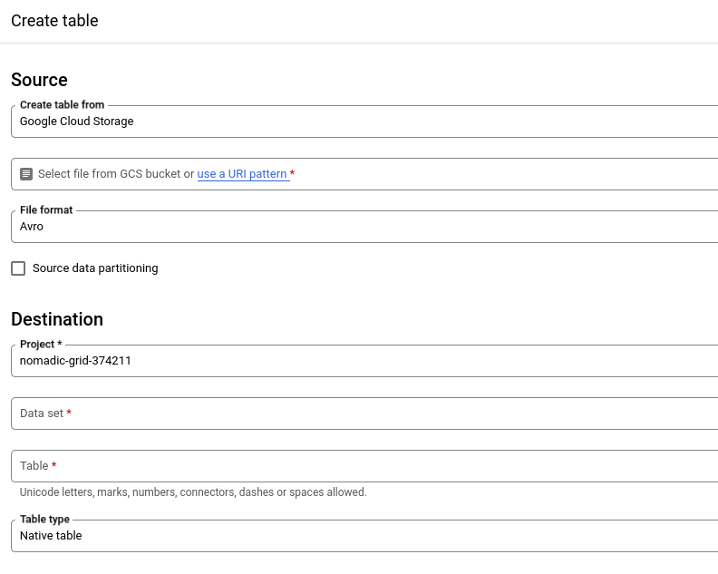
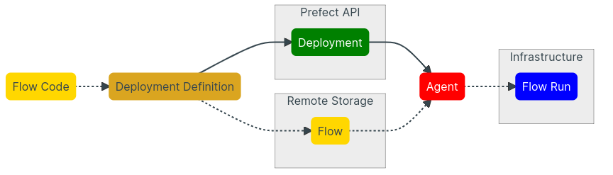

# Week 2 - Workflow orchestration (2023 cohort)


## Table of contents
* [Prerequisites: infrastructure deployment](#prerequisites-infrastructure-deployment).
* [Introduction to Prefect concepts](#introduction-to-prefect-concepts).
    + [Flow](#flow).
    + [Task](#task).
    + [Block](#block).
    + [From Python script to Prefect workflow](#from-python-script-to-prefect-workflow).
* [ETL with GCP and Prefect](#etl-with-gcp-and-prefect).
* [From Google Cloud Storage to Big Query](#from-google-cloud-storage-to-big-query).
* [Parameterizing flow and deployments](#parameterizing-flow-and-deployments).
  * [Parameterization](#parameterization).
  * [Prefect deployment](#prefect-deployment).
    * [Create a deployment on the CLI](#create-a-deployment-on-the-cli).
* [Schedules and Docker storage with infrastructure](#schedules-and-docker-storage-with-infrastructure).
  * [Scheduling our flows](#scheduling-our-flows).
  * [Running flows in Docker containers](#running-flows-in-docker-containers).
    * [Create a deployment from a Python script](#create-a-deployment-from-a-python-script).
* [Additional Prefect resources](#additional-prefect-resources).


**Sources:**
* DataTalksClub [videos](https://www.youtube.com/watch?v=W3Zm6rjOq70&list=PL3MmuxUbc_hJed7dXYoJw8DoCuVHhGEQb&index=17).
* Prefect [docs](https://docs.prefect.io/).


## Prerequisites: infrastructure deployment

Run Postgres and pgAdmin:

```bash
docker-compose -f ../../docker-compose.yml up -d
```

To shut it down:

```bash
docker-compose -f ../../docker-compose.yml down
```


## Introduction to Prefect concepts

[Video source](https://www.youtube.com/watch?v=cdtN6dhp708&list=PL3MmuxUbc_hJed7dXYoJw8DoCuVHhGEQb&index=19).


### [Flow](https://docs.prefect.io/concepts/flows/)

* Most basic Prefect object.
* The only Prefect abstraction that can be interacted with, displayed, and run without needing to reference any other aspect of the Prefect engine.
* Container for workflow logic which allows users to interact with and reason about the state of their workflows.
* Like functions: they can take inputs, perform work, and return an output.
* Flows take advantage of automatic Prefect logging to capture details about flow runs such as run time, task tags, and final state.
* All workflows are defined within the context of a flow.
* Flows can include calls to tasks as well as to other flows, which we call "subflows" in this context.
* Use: **@flow** decorator.


### [Task](https://docs.prefect.io/concepts/tasks/)

* Function that represents a discrete unit of work in a Prefect workflow.
* Tasks enable you to encapsulate elements of your workflow logic in observable units that can be reused across flows and subflows.
* Functions: they can take inputs, perform work, and return an output (same as flows).
* Not required.
* Special because they can receive metadata about upstream dependencies and the state of those dependencies before the function is run, even if they don't receive any explicit data inputs from them
* This gives you the opportunity to, for example, have a task wait on the completion of another task before executing.
* Tasks take advantage of automatic Prefect logging to capture details about task runs such as runtime, tags, and final state.
* All tasks must be called from within a flow. Tasks may not be called from other tasks.
* Use: **@task** decorator.

    ```python
    @task
    def my_task():
        print("Hello, I'm a task")

    @flow
    def my_flow():
        my_task()
    ```

### [Block](https://docs.prefect.io/concepts/blocks/)

* Primitive within Prefect that enable the storage of configuration and provide an interface for interacting with external systems.
* Useful for configuration that needs to be shared across flow runs and between flows.
* For securely store credentials for authenticating with services like AWS, GitHub, Slack, or any other system you'd like to orchestrate with Prefect.


### From Python script to Prefect workflow 

We are starting from our basic Python script `ingest_data.py` from first week, which pulls yellow taxi data into our Postgres database, and we will transform this script to be orchestrated with Prefect.


Initial [`ingest_data.py`](./flows/01_start/ingest_data.py).


We can run the script and then check via pgAdmin or pgcli that that the data have been correctly loaded into the database.

```bash
python ./flows/01_start/ingest_data.py
```

Now, we will transform the script to work as a Prefect workflow. For that:
* We make use of Prefect flows (and subflows) and tasks.
* We break `ingest_data` function into smaller pieces or tasks, so that we can have more visibility into each of these steps. These are: `extract_data`, `transform_data` and `load_data`.
* We create a connection block to connect with the Postgres database.
    + For that, we have previously installed the [`prefect-sqlalchemy`](https://prefecthq.github.io/prefect-sqlalchemy/) from the [Prefect Collection](https://docs.prefect.io/collections/catalog/) via the `requirements.txt` file.
    + In order to use it, we need to set the Postgres connection block through the UI (`Blocks -> Add blocks -> SQLAlchemy Connector`), with the following configuration
        ```
        { "driver": "postgresql+psycopg2", "database": "ny_taxi", "username": "root", "password": "root", "host": "localhost", "port": "5432" }
        ```  
    
    + Then, we import it into our Python file: `from prefect_sqlalchemy import SqlAlchemyConnector`.


We can open the Prefect UI by running:

```bash
prefect orion start

# First time setup
prefect config set PREFECT_API_URL=http://127.0.0.1:4200/api
```

After modifications are made: [`ingest_data_flow.py`](./flows/01_start/ingest_data_flow.py).

```bash
python ./flows/01_start/ingest_data_flow.py
```


## ETL with GCP and Prefect

[Video source](https://www.youtube.com/watch?v=W-rMz_2GwqQ&list=PL3MmuxUbc_hJed7dXYoJw8DoCuVHhGEQb&index=20).

We will look at more advanced use cases and perform some extract transform and load operations to Google Cloud platform.

In this session, we create the [`etl_web_to_gcs.py`](./flows/01_start/ingest_data_flow.py) script, where we:
* Download yellow taxi data from the web.
* Do some data transformation.
* Save locally as a parquet file.
* Load the resulting file into Google Cloud Storage.

Here is the workflow structure:

```
@flow: etl_to_gcs(...)
|_ @task: fetch(...)
|_ @task: clean(...)
|_ @task: write_local(...)
|_ @task: write_gcs(...)
```

Before we run the script, we need to add blocks to be able to work with GCP:
* First, we register the GCP blocks from the [`prefect_gcp`](https://prefecthq.github.io/prefect-gcp/) module that we have previously installed.

    ```bash
    prefect block register -m prefect_gcp
    ```
* Then we configure the blocks that we need from the Blocks page in the Prefect UI.
    + GCS Bucket.
        - Block name: dataeng-dtc-gcs-bucket
        - Bucket: name of the bucket created in GCS.
        - GCP credentials: dataeng-dtc-gcp-credentials (created below)
    + GCP Credentials.
        - Block name: dataeng-dtc-gcp-credentials
        - Service account info: data copied from our google credentials file at ~/.google/credentials/google_credentials.json.




Finally, we can run the script and check in Prefect UI and in GCS that it works as expected.

```bash
python ./flows/02_gcp/etl_web_to_gcs.py
```


## From Google Cloud Storage to Big Query

[Video source](https://www.youtube.com/watch?v=Cx5jt-V5sgE&list=PL3MmuxUbc_hJed7dXYoJw8DoCuVHhGEQb&index=21).

File: [`etl_gcs_to_bq.py`](./flows/02_gcp/etl_gcs_to_bq.py).

First, we create a table in BigQuery to have the schema we need. In our case, we already have a dataset (`trips_data_all`), which was created in [week 1 by using Terraform](../../week1_basics_n_setup/terraform_gcp/terraform/main.tf). From GCP console:
* Add data > Source: Google Cloud Storage.
* Select a file from GCS bucket: we choose the parquet file uploaded to GCS in the previous section.
* Destination:
  * Project: our GCP project for the course.
  * Table: we choose a name for the table.
* Once it's created, we remove all the rows (to leave just the schema) by running a query: `REMOVE FROM TABLE_NAME WHERE true`.





We can now run our Python file.

```bash
python ./flows/02_gcp/etl_gcs_to_bq.py
```


## Parameterizing flow and deployments

[Video source](https://www.youtube.com/watch?v=QrDxPjX10iw&list=PL3MmuxUbc_hJed7dXYoJw8DoCuVHhGEQb&index=22).


### Parameterization

We will see how to add parameterization into our flow and create deployments. For that, we are going to expand the [`etl_web_to_gcs.py`](./flows/02_gcp/etl_web_to_gcs.py) Python script created in a previous session.

We save our work in a new script: [`parameterized_flow.py`](./flows/03_deployments/parameterized_flow.py).

The idea behind this to not have hardcoded anymore parameters like `color`, `year` or `month`, but instead be able to pass them at runtime, and in this way have multiple flow run instances of that flow with different parameters that affect the outcome.

We create a parent flow to trigger the main flow n times (for example, to have the data from different months), so we have n instances of our main flow all from one parent flow.

Run the file:

```bash
python ./flows/03_deployments/parameterized_flow.py
```


### Prefect deployment

Now we want to be able to use a a [**Prefect deployment**](https://docs.prefect.io/concepts/deployments/) to make sure we can trigger and schedule these runs automatically, instead of having to do it manually.

A deployment in Prefect is a server-side concept that encapsulates a flow, allowing it to be scheduled and triggered via the API.



Thanks to that, we could have multiple deployments for a single flow. In our case, for example, we might have two deployments:
* One scheduled for yellow taxis.
* Another for green taxis.

**Deployment building:** two ways.
* [Through the CLI](https://docs.prefect.io/concepts/deployments/#create-a-deployment-on-the-cli): we will do it in this section.
* [From a Python object](https://docs.prefect.io/concepts/deployments/#create-a-deployment-from-a-python-object): we will see how to it in the nex section.


#### Create a deployment on the CLI

```bash
prefect deployment --help
```

1. Build the deployment.
   ```bash
   # prefect deployment build <filename>:<entrypoint to the flow> -n <deployment name>
   prefect deployment build ./flows/03_deployments/parameterized_flow.py:etl_parent_flow -n etl
   ```
   This creates the `etl_parent_flow-deployment.yaml` file with all the metadata Prefect needs for the workflow orchestration.
2. We can adjust the parameters in the YAML file or in the UI after we apply the deployment.
   ```yaml
    parameters: { "color": "yellow", "months" :[1, 2, 3], "year": 2021}
   ```
3. Apply the deployment.
   ```bash
   # prefect deployment apply <yaml_filename>
   prefect deployment apply etl_parent_flow-deployment.yaml
   ```
4. Now we can find, edit and run this deployment in the Prefect UI.
5. To run orchestrated deployments, we must configure at least one [**agent** (and its associated **work queue**)](https://docs.prefect.io/concepts/work-queues/).
    ```bash
    prefect agent start  --work-queue "default"
    ```
6. [OPTIONAL] As we see, we do not need to run our flows manually, but set them on schedule by using a deployment. Because of that, it may be useful to set up [notifications](https://docs.prefect.io/ui/notifications/). This way Prefect will let us know if the flow runs succeded or failed.


## Schedules and Docker storage with infrastructure

[Video source](https://www.youtube.com/watch?v=psNSzqTsi-s&list=PL3MmuxUbc_hJed7dXYoJw8DoCuVHhGEQb&index=23).


In this section we see:
* How to schedule our flows.
* How to run our flows in Docker containers.


### Scheduling our flows

We can schedule our deployments via Prefect UI or via CLI. Below we schedule a deployment when we create it (and apply it with the `-a` flag):

```bash
prefect deployment build ./flows/03_deployments/parameterized_flow.py:etl_parent_flow -n etl2 --cron "0 0 * * *" -a
```

We can also schedule a deployment which already exists (`prefect deployment set-schedule ...`).


### Running flows in Docker containers

So far we have run our flows locally in our machine, but to make things a little more production ready we are going to store our code in a Docker image and put it up on Docker Hub.

We create a [`Dockerfile`](./Dockerfile) for that, which will use [`docker-requirements.txt`](./docker-requirements.txt) file (a light version of our general `requirements.txt`) to install dependencies.

```bash
docker image build -t sergiogrz/prefect:dataeng_dtc .
docker image push sergiogrz/prefect:dataeng_dtc
```

Then, we add a Docker container block with the image we have just created. Two possibilites:
* From Prefect UI, as we have already seen in previous sections.
* By running [`make_docker_block.py`](./blocks/make_docker_block.py).


Next step, we create a deployment, this time from a Python script.

#### Create a deployment from a Python script

We make use of the Docker container that we built, based on the image we created.

[`docker_deploy.py`](./flows/03_deployments/docker_deploy.py).

```bash
python ./flows/03_deployments/docker_deploy.py
```

Make sure to [set the value of `PREFECT_API_URL`](https://docs.prefect.io/concepts/settings/#setting-and-clearing-values) as follows:

```bash
# prefect profile ls
prefect config set PREFECT_API_URL=http://127.0.0.1:4200/api
```

We start an agent:

```bash
prefect agent start -q default
```

Finally we can run our flow. In this case, we override the parameter *months* at runtime.

```
prefect deployment run etl-parent-flow/docker-flow -p "months=[1,2]"
```


## Additional Prefect resources

* [Prefect Cloud](https://docs.prefect.io/ui/overview/).
* [Anna Geller Prefect guides](https://github.com/anna-geller).
* [Prefect Community](https://discourse.prefect.io/).