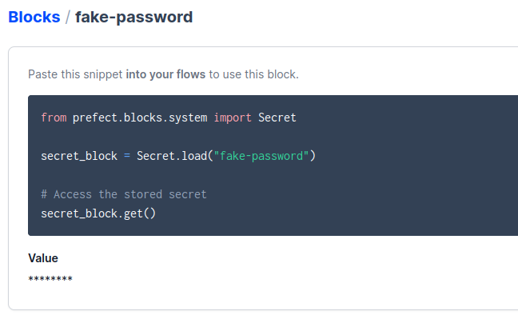

# Week 2 homework solutions (Prefect 2023 cohort)

Before we start, we open Prefect UI by running `prefect orion start`.


## Question 1. Load January 2020 data

For this question, we slightly modify the original [`etl_web_to_gcs.py`](../flows/02_gcp/etl_web_to_gcs.py) script to create [`etl_web_to_gcs_hw.py`](./etl_web_to_gcs_hw.py). In the new file, we make use of the *argparse* module to parametrize *color*, *year* and *month* and pass their values at runtime.

We also adapt the code to take into account the differences between yellow taxi and green taxi data columns (*tpep_pickup_datetime*/*tpep_dropoff_datetime* for yellow vs *lpep_pickup_datetime*/*lpep_dropoff_datetime* for green).


```bash
python etl_web_to_gcs_hw.py \
    --color=green \
    --year=2020 \
    --month=1
```

**Answer:** The dataset contains 447,770 rows (we check the logs to find out).


## Question 2. Scheduling with Cron

We use the CLI to build and apply the deployment, and specify the schedule by using the `--cron` flag.

```bash
prefect deployment build ../flows/02_gcp/etl_web_to_gcs.py:etl_web_to_gcs -n etl_web_to_gcs_dep --cron "0 5 1 * *" -a
```

**Answer:** To run the deployment on the first of every month at 5am UTC we must use the _"0 5 1 * *"_ cron expression. This [page](https://crontab.guru/) can help us.


## Question 3. Loading data to BigQuery

First, we need to transfer Yellow taxi data for February and March 2019 from the web to our GCS bucket. We make use of the `etl_web_to_gcs_hw.py` created for Question 1 to do this.

```bash
python etl_web_to_gcs_hw.py --color=yellow --year=2019 --month=2
python etl_web_to_gcs_hw.py --color=yellow --year=2019 --month=3
```

Once we have the parquet files in GCS, we are going to extract it and load it into BigQuery. For that, we start from the [`etl_gcs_to_bq.py`](../flows/02_gcp/etl_gcs_to_bq.py) script and adapt it to our needs. We save the modified file as [`etl_gcs_to_bq_hw.py`](./etl_gcs_to_bq_hw.py).

We can check that it works as expected.

```bash
python etl_gcs_to_bq_hw.py
```

Next, we start an agent with a work queue to execute the flow runs from the deployment.

```bash
prefect agent start --work-queue 'default'
```

We build and apply a deployment. Finally, we run it with the values that we need for the parameters.

```bash
prefect deployment build ./etl_gcs_to_bq_hw.py:etl_gcs_to_bq_parent --name=etl_hw --apply
prefect deployment run etl-gcs-to-bq-parent/etl_hw --params='{"color": "yellow", "year": 2019, "months": [2, 3]}'
```

**Answer:** Total number of rows processed: 14,851,920.


## Question 4. Github Storage Block


## Question 5. Email or Slack notifications


## Question 6. Secrets

From Prefect UI: Blocks > Add block > Secret > Block name + value > Create

.


**Answer:** 8 characters are shown as asterisks.


