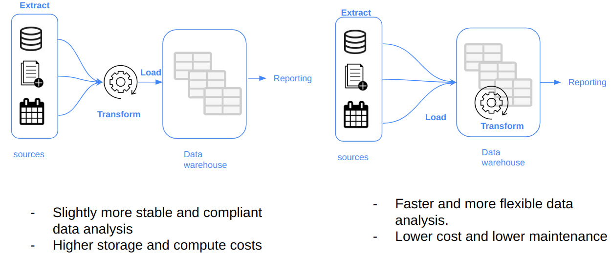
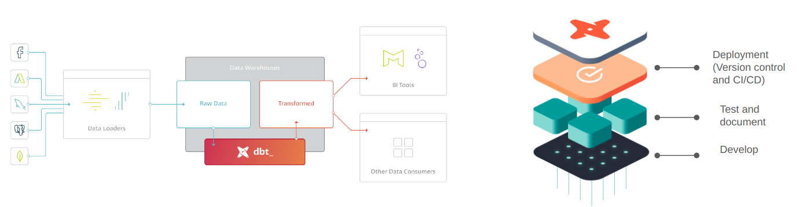
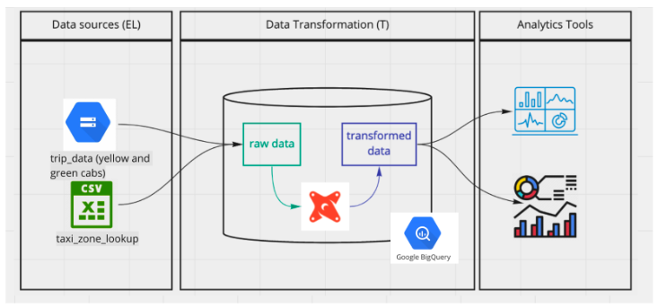

# Week 4 - Analytics engineering

Goal: Transforming the data loaded in DWH to Analytical Views developing a dbt project.

## Table of contents

1. [Analytics engineering basics](#1-analytics-engineering-basics).
    1. [What is analytics engineering?](#11-what-is-analytics-engineering).
    2. [Data modeling concepts](#12-data-modeling-concepts).
2. [What is dbt?](#2-what-is-dbt).
    1. [How does dbt work?](#21-how-does-dbt-work).
    2. [How to use dbt?](#22-how-to-use-dbt).

**Sources**
* DataTalksClub [videos](https://www.youtube.com/watch?v=uF76d5EmdtU&list=PL3MmuxUbc_hJed7dXYoJw8DoCuVHhGEQb).
* DataTalksClub [slides](https://docs.google.com/presentation/d/1xSll_jv0T8JF4rYZvLHfkJXYqUjPtThA/edit?usp=sharing&ouid=114544032874539580154&rtpof=true&sd=true).
* Álvaro Navas [notes](https://github.com/ziritrion/dataeng-zoomcamp/blob/main/notes/4_analytics.md).

## 1. Analytics engineering basics

[Video source](https://www.youtube.com/watch?v=uF76d5EmdtU&list=PL3MmuxUbc_hJed7dXYoJw8DoCuVHhGEQb).

### 1.1 What is analytics engineering?

Across the years, there has been a series of data domain developments that have changed they way we work with data:
1. Massively parallel processing (MPP) databases.
2. Data-pipelines-as-a-service.
3. SQL - first.
4. Version control systems.
5. Self-service analytics.
6. Data governance.

The analytics engineer role tries to feel the gap between the data engineer and the data scientist/analyst. It introduces the good software engineering practices to the efforts of data analysts and data scientists. Some of the tools that the analytics engineer may be exposed to are:
* Data loading ([Fivetran](https://www.fivetran.com/), [Stitch](https://www.stitchdata.com/)).
* Data storing (Data Warehouses, such as [Snowflake](https://www.snowflake.com/en/), [BigQuery](https://cloud.google.com/bigquery), [Redshift](https://aws.amazon.com/redshift/)).
* Data modeling ([dbt](https://www.getdbt.com/), [Dataform](https://dataform.co/)).
* Data presentation (BI tools like [Google Data Studio](https://datastudio.withgoogle.com/), [Looker](https://www.looker.com/), [Mode](https://mode.com/), [Tableau](https://www.tableau.com/)).

In this lesson we will focus on the last two parts: data modeling and data presentation.

### 1.2 Data modeling concepts

In [week 2](../week2_workflow_orchestration/prefect/README.md#etl-vs-elt) we compared ETL vs ELT processes. Here we will dive more in the transformation step of the ELT.

#### Kimball's dimensional modeling

Objective:
* Deliver data understandable to the business users.
* Deliver fast query performance.

Approach: prioritise user understandability and query performance over normalization / non-redundant data (3NF).  

Other approaches:
* Bill Inmon.
* Data vault.

**Elements of dimensional modeling**  
* Fact tables.
    * Measurements, metrics or facts.
    * Corresponds to a business process.
    * "Verbs".
* Dimension tables.
    * Corresponds to a business entity.
    * Provides context to a business process.
    * "Nouns".

They can be organised in a star schema or in a snowflake schema ([Link](https://www.geeksforgeeks.org/difference-between-star-schema-and-snowflake-schema/)).

**Architecture of dimensional modeling**
* Stage area.
    * Contains the raw data.
    * Not meant to be exposed to everyone.
* Processing area.
    * From raw data to data models.
    * Focuses in efficiency.
    * Ensuring standards.
* Presentation area.
    * Final presentation of the data.
    * Exposure to business stakeholder.

## 2. What is dbt?

[Video source](https://www.youtube.com/watch?v=4eCouvVOJUw&list=PL3MmuxUbc_hJed7dXYoJw8DoCuVHhGEQb).

[dbt](https://www.getdbt.com/) stands for ***data build tool***, and is a transformation tool that allows anyone that knows SQL to deploy analytics code following software engineering best practices like modularity, portability, CI/CD, and documentation.

After we extract and load the raw data into our Data Warehouse, we need to transform this data to later expose it to our stakehoulders and be able to perform analysis. dbt helps us transform our data in the DW, but it also introduces good software practices by defining a development workflow (develop / test / deploy).

### 2.1 How does dbt work?

* In our DW we have our raw data.
* dbt adds a modeling layer, where data is transformed (_derived model_).
* The model with the transformed data is then stored in the Data Warehouse for persistance.
* Each model is:
    * An SQL file.
    * With a SELECT statement, no DDL or DML.
    * A file that dbt will compile and run in our DW.

### 2.2 How to use dbt?

Two main components:
* **dbt Core**.
    * Open-source project that allows data transformations.
    * Builds and runs a dbt project (SQL and YAML files).
    * Includes SQL compilation logic, macros and database adapters.
    * Includes a CLI to run dbt commands locally.
    * Open source and free to use.

* **dbt Cloud**.
    * SaaS application to develop and mangae dbt projects.
    * Web-based IDE to develop, run and test a dbt project.
    * Includes a scheduler for workflow orchestration.
    * Logging and alerting.
    * Integrated documentation.
    * Free for individuals (one developer seat).

We can take one of the two ways below to follow the dbt lessons:
* With BigQuery (cloud):
    * Development using cloud IDE.
    * No local installation of dbt Core (all will be done in the cloud).
* With Postgres (local):
    * Development usin a local IDE of our choice.
    * Local installation of dbt Core connecting to the Postgres database.
    * Run dbt models through the CLI.

## 3. Setting up dbt

### 3.1 BigQuery + dbt Cloud (alternative A)

[Video source](https://www.youtube.com/watch?v=iMxh6s_wL4Q&list=PL3MmuxUbc_hJed7dXYoJw8DoCuVHhGEQb).

[Documentation](https://docs.getdbt.com/docs/build/projects) dbt projects.

Before we begin, we create in BigQuery two new empty datasets: one for the models during development phase, and another one for the deployment/production environment. We name them as _dbt_development_ and _dbt_deployment_.

In order to use dbt Cloud we need to create a [user account](https://www.getdbt.com/). 

