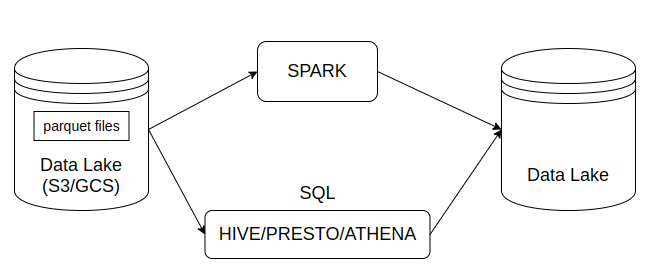
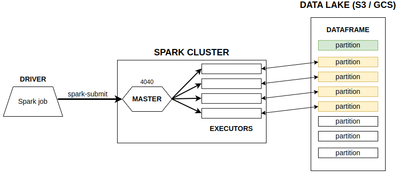
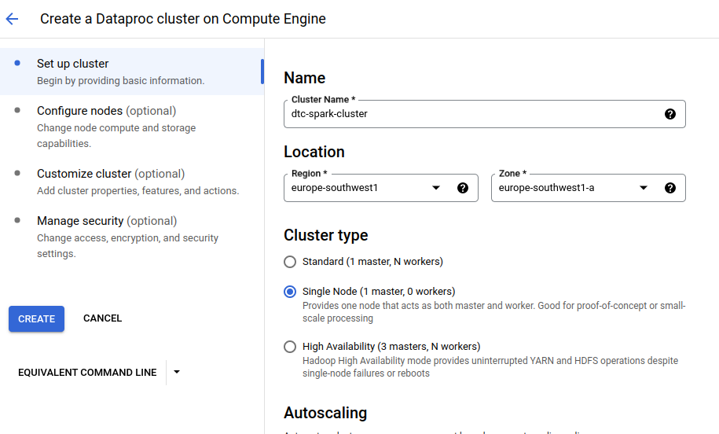
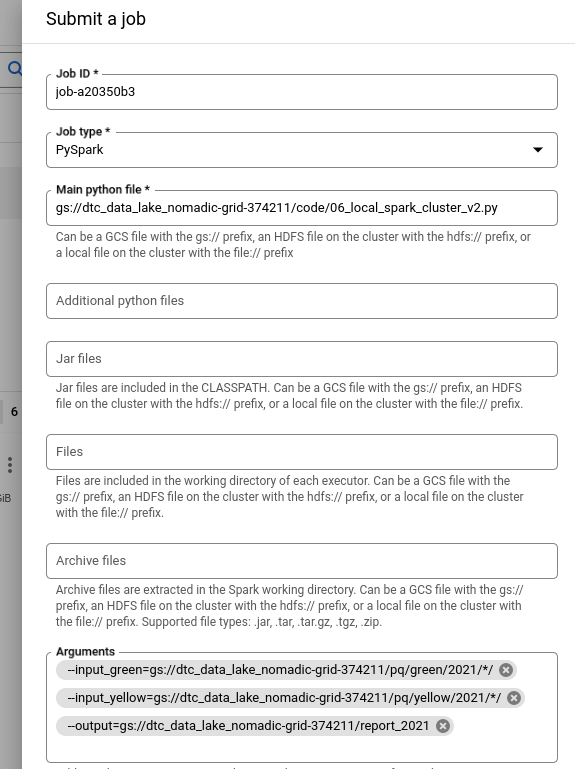

# Week 5 - Batch processing

## Table of contents

1. [Introduction to batch processing](#1-introduction-to-batch-processing).
2. [Introduction to Spark](#2-introduction-to-spark).
3. [Installing Spark on Linux](#3-installing-spark-on-linux).
4. [First look at Spark / Pyspark](#4-first-look-at-spark--pyspark).
   1. [Creating a Spark session](#41-creating-a-spark-session).
   2. [Reading CSV files](#42-reading-csv-files).
   3. [Partitions / saving to parquet files](#43-partitions--saving-to-parquet-files).
5. [Spark dataframes](#5-spark-dataframes).
   1. [Actions vs transformations](#51-actions-vs-transformations).
   2. [Functions and User Defined Functions (UDFs)](#52-functions-and-user-defined-functions-udfs).
6. [SQL with Spark](#6-sql-with-spark).
7. [Spark internals](#7-spark-internals).
   1. [Anatomy of a Spark cluster](#71-anatomy-of-a-spark-cluster).
   2. [GroupBy in Spark](#72-groupby-in-spark).
   3. [Joins in Spark](#73-joins-in-spark).
      1. [Joining two large tables](#731-joining-two-large-tables).
      2. [Joining a large table and a small table](#732-joining-a-large-table-and-a-small-table).
   4. [Resilient Distributed Datasets (RDDs)](#74-resilient-distributed-datasets-rdds).
      1. [RDDs: map and reduce](#741-rdds-map-and-reduce).
      2. [Spark RDD mapPartitions](#742-spark-rdd-mappartitions).
8. [Running Spark in the Cloud](#8-running-spark-in-the-cloud).
   1. [Connecting to Google Cloud Storage](#81-connecting-to-google-cloud-storage).
      1. [Uploading data to GCS](#811-uploading-data-to-gcs).
      2. [Connecting Spark jobs to GCS](#812-connecting-spark-jobs-to-gcs).
   2. [Creating a local Spark cluster](#82-creating-a-local-spark-cluster).
   3. [Setting up a Dataproc cluster](#83-setting-up-a-dataproc-cluster).


**Sources:**
* DataTalksClub [videos](https://www.youtube.com/watch?v=dcHe5Fl3MF8&list=PL3MmuxUbc_hJed7dXYoJw8DoCuVHhGEQb).
* Álvaro Navas [notes](https://github.com/ziritrion/dataeng-zoomcamp/blob/main/notes/5_batch_processing.md).


## 1. Introduction to batch processing

[Video source](https://www.youtube.com/watch?v=dcHe5Fl3MF8&list=PL3MmuxUbc_hJed7dXYoJw8DoCuVHhGEQb).

**Batch vs streaming**

* **Batch processing:** processing chunks of data at regular intervals.
  * Examples of batch jobs: weekly, daily, hourly, ...
* **Stream processing:** processing data on the fly.


**Technologies for batch processing**

* Python scripts (as we saw in week 1).
  * Can be run in Kubernetes, AWS Batch, etc.
* SQL (like dbt models that we saw in week 4).
* Spark (we cover it this week).
* Flink.


**Orchestrating batch jobs**

It is usually done by a data workflow orchestration tool, like **Airflow**. Example of a typical workflow for batch jobs:

```
 csv  -> Python -> SQL (dbt) -> Spark -> Python
(Lake)
```

**Advantages and disadvantages of batch jobs**
* Advantages:
  * Easy to manage.
  * Retry.
  * Scale.
  * Easier to orchestrate.
* Disadvantages:
  * Delay.


## 2. Introduction to Spark

[Video source](https://www.youtube.com/watch?v=FhaqbEOuQ8U&list=PL3MmuxUbc_hJed7dXYoJw8DoCuVHhGEQb).

[Apache Spark](https://spark.apache.org/) is an open-source unified analytics engine for large-scale data processing.
* The processing happens in Spark (in its machines or executors), that is why it is an **engine**.
* It is **distributed**, so it can be run in _clusters_ with multiple _nodes_, each pulling and transforming data.
* It is **multi-language**, we can use Java, Scala (native way), and in other languages by using wrappers.
* Spark can deal with both batch and stream processing.

The Spark wrapper for Python is called [PySpark](https://spark.apache.org/docs/latest/api/python/).


**When to use Spark**

Typically used when our data (for example, several parquet files) is in a data lake (S3/GCS). So Spark would pull this data, do some processing and then put the data back in the data lake.

If we can express our batch job as SQL, we can make use of tools like Hive, Presto or Athena. However, sometimes this is not possible (because we need more flexibility, because we have to apply more complex manipulation -for example, ML models-). In those cases, we should go with Spark.





## 3. Installing Spark on Linux

[Video source](https://www.youtube.com/watch?v=hqUbB9c8sKg&list=PL3MmuxUbc_hJed7dXYoJw8DoCuVHhGEQb).
[Instructions](https://github.com/DataTalksClub/data-engineering-zoomcamp/tree/main/week_5_batch_processing/setup).


## 4. First look at Spark / PySpark

[Video source](https://www.youtube.com/watch?v=r_Sf6fCB40c&list=PL3MmuxUbc_hJed7dXYoJw8DoCuVHhGEQb).

We use the [01_pyspark_first_steps.ipynb](./notebooks/01_pyspark_first_steps.ipynb) notebook for this lesson.


### 4.1 Creating a Spark session

We start by importing PySpark.

```python
import pyspark
from pyspark.sql import SparkSession
```

We need to instantiate a **SparkSession**, an object that we use to interact with Spark.

```python
spark = SparkSession.builder \
    .master("local[*]") \
    .appName("test") \
    .getOrCreate()
```

* `SparkSession` is the class of the object that we instantiate. `builder` is the builder method.
* `master()` sets the Spark _master URL_ to connect to. The `local` string means that Spark will run on a local cluster. `[*]` means that Spark will run with as many CPU cores as possible.
* `appName()` defines the name of our application/session. This will show in the Spark UI.
* `getOrCreate()` will create the session or recover the object if it was previously created.

Once we've instantiated a session, we can access the Spark UI by browsing to `localhost:4040`. The UI will display all current jobs. Since we've just created the instance, there should be no jobs currently running.


### 4.2 Reading CSV files

For this example we will use the [High Volume For-Hire Vehicle Trip Records for January 2021](https://github.com/DataTalksClub/nyc-tlc-data/releases/tag/fhvhv) file.

Similarly to Pandas, Spark can read CSV files into ***dataframes***, a tabular data structure. Unlike Pandas, Spark can handle much bigger datasets but it's unable to infer the datatypes of each column.

Let's read the file and create a dataframe:

```python
df = spark.read \
    .option("header", "true") \
    .csv("../data/fhvhv_tripdata_2021-01.csv.gz")
```
* `read()` reads the file.
* `option()` contains options for the `read` method. In this case, we're specifying that the first line of the CSV file contains the column names.
* `csv()` is for reading CSV files.

We can see the contents of the dataframe with `df.show()` (only a few rows will be shown) or `df.head()`. We can also check the current schema with `df.printSchema()`; you will notice that all values are strings.

We can use a trick with Pandas to infer the datatypes:
1. Create a smaller CSV file with the first 100 records.
2. Import Pandas and create a Pandas dataframe. This dataframe will have inferred datatypes.
3. Create a Spark dataframe from the Pandas dataframe and check its schema.
    ```python
    spark.createDataFrame(df_pandas).schema
    ```
4. Based on the output of the previous method, import `types` from `pyspark.sql` and create a `StructType` containing a list of the datatypes.
    ```python
    from pyspark.sql import types
    schema = types.StructType([...])
    # or from pyspark.sql.types import StructType, StructField, StringType, TimestampType, IntegerType
    # schema = StructType([...])
    
    ```
    * `types` contains all of the available data types for Spark dataframes.
5. Create a new Spark dataframe and include the schema as an option.
    ```python
    df = spark.read \
        .option("header", "true") \
        .schema(schema) \
        .csv("../data/fhvhv_tripdata_2021-01.csv.gz")
    ```

Another options, which saves us all these steps, is to set the `inferSchema` option to True.

```python
df = spark.read \
    .option("header", True) \
    .option("inferSchema", True) \
    .csv("../data/fhvhv_tripdata_2021-01.csv.gz")
```


### 4.3 Partitions / saving to parquet files

A **Spark cluster** is composed of multiple **executors**. Each executor can process data independently in order to parallelize and speed up work.

In the previous example we read a single large CSV file. This file can only be read by a single executor, which means that the rest of the executors will be idle and we will not take advantage of parallelization. 

To avoid this we can split a file into multiple parts so that each executor can take care of a part and have all executors working simultaneously. These splits are called **partitions**.

In our example, we partition the dataframe that we obtained when reading the CSV file, and save the result in parquet format. This will create multiple parquet files.

```python
# create 24 partitions of the dataframe
df = df.repartition(24)
# save the partitions in parquet format
df.write.parquet("../data/fhvhv/2021/01/")
```

We can check in the Spark UI the progress of our jobs, which are divided into stages that contain tasks. The tasks in a stage will not start until all tasks in the previous stage are finished.

When creating a dataframe, Spark produces as many partitions as CPU cores available by default, and each partition creates a task. 

Besides the 24 parquet files, you should also see a `_SUCCESS` file which should be empty. This file is created to indicate that the job have finished successfully.

Trying to write the files again will output an error because Spark will not write to a non-empty folder. You can force an overwrite with the `mode` argument:

```python
df.write.parquet("../data/fhvhv/2021/01/", mode="overwrite")
```

The opposite of partitioning (joining multiple partitions into a single partition) is called ***coalescing***.


## 5. Spark dataframes

[Video source](https://www.youtube.com/watch?v=ti3aC1m3rE8&list=PL3MmuxUbc_hJed7dXYoJw8DoCuVHhGEQb).

We can read as a dataframe the parquet files we have created in the previpus section. Parquet contains the information about schema, so, unlike with CSV, we do not need to specify or infer it when reading the files. This is one of the reasons parquet files are smaller than CSVs: since the "know" the schema they use more efficient ways of compressing the data (for example, storing as integers instead of long values).

```python
df = spark.read.parquet("../data/fhvhv/2021/01/")
df.printSchema()
```

We can apply many Pandas-like operations to Spark dataframes.
* If we want to select a few columns, we use `select()` method.
* To filter by some value, we use `filter()`.
    ```python
    df.select("pickup_datetime", "PULocationID", "dropoff_datetime", "DOLocationID") \
        .filter(df.PULocationID == 256) \
        .show() 
    ```
* We can find some of the many other operations that we can do with Spark in [this quickstart guide from the official Spark documentation](https://spark.apache.org/docs/latest/api/python/getting_started/quickstart_df.html).


### 5.1 Actions vs transformations

Spark uses a programming concept called **lazy evaluation**. Before Spark does anything with the data in your program, it first builds step-by-step directions of what functions and data it will need. Spark builds the **DAG** from your code, and checks if it can procrastinate, waiting until the last possible moment to get the data. So for example, in the code above, Spark does not really do any job until we call the `show()` method.

In Spark we differenciate between actions and transformations:
* **Transformations:** lazy operations, which are not executed right away. These are operations we use for transforming the data, such as:
  * Selecting columns.
  * Filtering.
  * Joins.
  * Group by operations.
  * Partitions.
  * ...
* **Actions:** eager operations, those that are executed right away. Computations only happen when an action is triggered, so then the job will have to perform all of the transformations that lead to that action to produce a value. Exxamples of actions are:
  * Show, take, head.
  * Write, read.
  * ...


### 5.2 Functions and User Defined Functions (UDFs)

Besides the SQL and Pandas-like commands we've seen so far, Spark provides additional built-in functions that allow for more complex data manipulation. By convention, these functions are imported as follows:

```python
from pyspark.sql import functions as F
```

Example of built-in functions usage:

```python
df \
    .withColumn("pickup_date", F.to_date(df.pickup_datetime)) \
    .withColumn("dropoff_date", F.to_date(df.dropoff_datetime)) \
    .select("pickup_date", "PULocationID", "dropoff_date", "DOLocationID") \
    .show()
```
* `withColumn()`: adds a new column to the dataframe.
* `F.to_date()`: converts timestamp to date format.

Find the list of built-in functions in the [Spark documentation](https://spark.apache.org/docs/latest/api/sql/index.html).

We can also create our own **User Defined Functions (UDFs)**. UDFs are regular functions which are then passed as parameters to a special builder

```python
# function that changes values when they're divisible by 7 or 3
def crazy_stuff(base_num):
    num = int(base_num[1:])
    if num % 7 == 0:
        return f"s/{num:03x}"
    elif num % 3 == 0:
        return f"a/{num:03x}"
    else:
        return f"e/{num:03x}"

# convert the previous regular function into a UDF
crazy_stuff_udf = F.udf(crazy_stuff, returnType=StringType())

# apply the UDF to our dataframe
df \
    .withColumn("pickup_date", F.to_date(df.pickup_datetime)) \
    .withColumn("dropoff_date", F.to_date(df.dropoff_datetime)) \
    .withColumn("base_id", crazy_stuff_udf(df.dispatching_base_num)) \
    .select("base_id", "pickup_date", "PULocationID", "dropoff_date", "DOLocationID") \
    .show()
```


## 6. SQL with Spark

[Video source](https://www.youtube.com/watch?v=uAlp2VuZZPY&list=PL3MmuxUbc_hJed7dXYoJw8DoCuVHhGEQb).

First of all, we copy the directory with all the parquet files from [[dataeng_dtc_root]/data/pq](../data/pq/) to [week5_batch_processing/data](./data) folder.

We use the [02_spark_sql.ipynb](./notebooks/02_spark_sql.ipynb) notebook for this lesson.

Before doing some queries, we want to combine both yellow and green taxi data in one dataframe. To achieve this, we need to do some preprocessing:
* Rename pickup and dropoff datetime columns to have a common name for both taxi types.
* Make sure we keep some column order.
* Add a _service_type_ column to differenciate yellow from green trips.
  * `F.lit()` adds a literal or constant to a dataframe.

    ```python
    df_green = spark.read.parquet("../data/pq/green/*/*")
    df_green = df_green \
        .withColumnRenamed("lpep_pickup_datetime", "pickup_datetime") \
        .withColumnRenamed("lpep_dropoff_datetime", "dropoff_datetime")

    df_yellow = spark.read.parquet("../data/pq/yellow/*/*")
    df_yellow = df_yellow \
        .withColumnRenamed("tpep_pickup_datetime", "pickup_datetime") \
        .withColumnRenamed("tpep_dropoff_datetime", "dropoff_datetime")


    common_columns = []
    yellow_columns = set(df_yellow.columns)
    for col in df_green.columns:
        if col in yellow_columns:
            common_columns.append(col)

    from pyspark.sql import functions as F

    df_green_sel = df_green \
        .select(common_columns) \
        .withColumn("service_type", F.lit("green"))

    df_yellow_sel = df_yellow \
        .select(common_columns) \
        .withColumn("service_type", F.lit("yellow"))
    ```

Now, we can combine both datasets.

```python
df_trips_data = df_green_sel.unionAll(df_yellow_sel)
df_trips_data.groupBy("service_type").count().show()
```

Once we have a global dataframe, we can start doing some queries on it. To do that, we need to register our dataframe as a table first.

```python
df_trips_data.createOrReplaceTempView("trips_data")
```

Finally, we can perform SQL operations on our registerd table.

```python
spark.sql("""
SELECT service_type, COUNT(1) 
FROM trips_data
GROUP BY service_type
""").show()
```

```python
df_result = spark.sql("""
SELECT 
    -- Revenue grouping 
    PULocationID AS revenue_zone,
    date_trunc('month', pickup_datetime) AS revenue_month, 
    service_type, 

    -- Revenue calculation 
    SUM(fare_amount) AS revenue_monthly_fare,
    SUM(extra) AS revenue_monthly_extra,
    SUM(mta_tax) AS revenue_monthly_mta_tax,
    SUM(tip_amount) AS revenue_monthly_tip_amount,
    SUM(tolls_amount) AS revenue_monthly_tolls_amount,
    SUM(improvement_surcharge) AS revenue_monthly_improvement_surcharge,
    SUM(total_amount) AS revenue_monthly_total_amount,
    SUM(congestion_surcharge) AS revenue_monthly_congestion_surcharge,

    -- Additional calculations
    AVG(passenger_count) AS avg_montly_passenger_count,
    AVG(trip_distance) AS avg_montly_trip_distance
FROM
    trips_data
GROUP BY
    1, 2, 3
""")
```

To store the result in parquet format, we could run:

```python
df_result.write.parquet("../data/report/revenue/")
```

However, with our current dataset, this would create about 200 parquet files of very small size, which isn't desirable.

In order to reduce the amount of files, we need to reduce the amount of partitions of the dataset, which is done with the `coalesce()` method. The following command reduces the amount of partitions to 1.

```python
df_result.coalesce(1).write.parquet("../data/report/revenue", mode="overwrite")
```


## 7. Spark internals

### 7.1 Anatomy of a Spark cluster

[Video source](https://www.youtube.com/watch?v=68CipcZt7ZA&list=PL3MmuxUbc_hJed7dXYoJw8DoCuVHhGEQb).

So far, we have used a local cluster, where we have everything (master, executors, ...) in one computer. But a Spark cluster can contain multiple computers that work together.

Spark clusters are managed by a **master**, which is their entrypoint and usually has its UI on the port `4040`. When a **driver** submits a Spark job (a driver can be an Airflow DAG, a computer running a local script, etc.), it sends the code to execute to the master, which acts as a cordinator and divides the work among the cluster's **executors** (these are the machines that actually do the computation). If any executor fails and becomes offline for any reason, the master will reassign the task to another executor. Once an executor finishes a task, it takes another one to process, until all the tasks are completed.

Each executor will fetch a dataframe partition stored in a Data Lake (usually S3, GCS or a similar cloud provider), do something with it and then store it somewhere, which could be the same Data Lake or somewhere else. If there are more partitions than executors, executors will keep fetching partitions until every single one has been processed.



This is in contrast to **Hadoop**, another data analytics engine, whose executors locally store the data they process (instead of downloading data on the machine, Hadoop download code on the machine that already has the data). This introduces the concept of **data locality**. Partitions in Hadoop are duplicated across several executors for redundancy, in case an executor fails for whatever reason (Hadoop is meant for clusters made of commodity hardware computers). However, data locality has become less important as storage and data transfer costs have dramatically decreased and nowadays it is feasible to separate storage from computation, so Hadoop has become less popular. 

The prefered way nowadays is to keep the files in the cloud storage provider. So the executors do not keep the data with them, but instead pull data (usually small files or partitions) from the cloud, process it and save the results back in the data lake.


### 7.2 GroupBy in Spark

[Video source](https://www.youtube.com/watch?v=9qrDsY_2COo&list=PL3MmuxUbc_hJed7dXYoJw8DoCuVHhGEQb).

To explain how Sparks deals with GroupBy operations we use the [03_groupby_join.ipynb](./notebooks/03_groupby_join.ipynb) notebook.

Let's imagine we have the following query:

```python
df_green_revenue = spark.sql("""
SELECT 
    date_trunc('hour', lpep_pickup_datetime) AS hour,
    PULocationID AS revenue_zone,
    SUM(total_amount) AS amount,
    COUNT(1) AS number_records
FROM
    green_data
WHERE lpep_pickup_datetime >= '2020-01-01 00:00:00'
GROUP BY
    1, 2
""")
```

This query outputs the total revenue and amount of trips per hour per zone, so we need to group by hour and zones to get the desired results.

On the one hand, we need to group data which is split into different partitions. On the other hand, we have a cluster with some executors, which can only process an individual partition at a time. Spark solves this issue by separating the grouping in 2 stages:

1. In the first stage, each executor performs the _GROUP BY_ operation within the partition, and outputs the result to a temporary partition. These temporary partitions are the **intermediate results**.
2. In the second stage, we combine the intermediate results by **reshuffling** the data: Spark puts all the records with the same keys (in our example, the _GROUP BY_ keys, which are _hour_ and _revenue\_zone_) in the same partition. The algorithm that does this is called ***external merge sort***. Once the shuffling has finished, Spark applies the _GROUP BY_ again to these new partitions, and combines (**reduces**) the records to the final output.
    * NOTE: after reshuffling the data, one partition may contain more than one key, but all the records with the same key must be in the same partition.

Shuffling is an expensive operation, so generally we would want to reduce the amount of data to shuffle when querying.


### 7.3 Joins in Spark

[Video source](https://www.youtube.com/watch?v=lu7TrqAWuH4&list=PL3MmuxUbc_hJed7dXYoJw8DoCuVHhGEQb).

For this section we use the same [03_groupby_join.ipynb](./notebooks/03_groupby_join.ipynb) notebook as for the previous one.

Spark uses similar mechanisms for _GROUP BY_ and for _JOIN_ operations. But we can differenciate two cases: joining two large tables and joining a large table and a small table. 


#### 7.3.1 Joining two large tables

In our example, we start with the yellow and green taxi dataframes that we have created in [section 7.2 - GroupBy in Spark](#72-groupby-in-spark), and we want to join them by hour and by zone. So, before the join, we create two temporary tables renaming some columns, to be able to differenciate them in the final table. Then, we perform an **outer join** to include records that are only in one of the temporary dataframes.


```python
df_green_revenue_tmp = df_green_revenue \
    .withColumnRenamed("amount", "green_amount") \
    .withColumnRenamed("number_records", "green_number_records")

df_yellow_revenue_tmp = df_yellow_revenue \
    .withColumnRenamed("amount", "yellow_amount") \
    .withColumnRenamed("number_records", "yellow_number_records")

df_join = df_green_revenue_tmp.join(df_yellow_revenue_tmp, on=["hour", "revenue_zone"], how="outer")
```

Once we trigger an action (`show()`, `write()`, ...) on `df_join`, Spark creates the two temporary dataframes and the final join dataframe. If we check the DAG in the Spark UI we will see three stages:
* Stages 1 and 2 belong to the creation of `df_green_revenue_tmp` and `df_yellow_revenue_tmp`.
* For stage 3, let's name `Y1, Y2, ..., Yn` the yellow taxi records, `G1, G2, ..., Gm` the green taxi records, and `K = (hour H, revenue_zone Z)` our composite key. So we can express the records as `(Kn, Yn)` for yellow taxi and `(Km, Gm)` for green taxi. In the beginning of this stage, we have yellow taxi records and green taxi records distributed along their own partitions (that means, in a partition we do not have yet mixed yellow and green taxi records). So Spark **reshuffles** the data, using the **external merge sort algorithm**, to make sure that records with the same key are the same partition, and then it **reduces** the records by joining yellow and green taxi data with the same keys in one final record.


#### 7.3.2 Joining a large table and a small table

For this example, we use the `zones` lookup table to identify _revenue\_zone_ in our `df_join` table.

```python
df_result = df_join.join(df_zones, on=df_join.revenue_zone == df_zones.LocationID)
```

In this case, Spark performs **broadcasting**, instead of **merge sort**. It does it that way because the `zones` table is very small. Spark _broadcasts_ or sends a copy of the entire table to each of the executors, and then each executor joins each partition of the big table in memory by performing a lookup on the local broadcasted table. That way there is no need for reshuffling, and this greatly speeds up the join operation.


### 7.4 Resilient Distributed Datasets (RDDs)

Topics related to this section are shown in the [`04_rdds.ipynb`](./notebooks/04_rdds.ipynb) notebook.


#### 7.4.1 RDDs: map and reduce

[Video source](https://www.youtube.com/watch?v=Bdu-xIrF3OM&list=PL3MmuxUbc_hJed7dXYoJw8DoCuVHhGEQb).

Dataframes are implemented on top of another data structure called Resilient Distributed Dataset, or RDD, which is a lower level abstraction.

Since Spark added support for dataframes and SQL, in general there is no need to work directly with RDDs, which is more complex and time-consuming. But knowing how they work can help us understand how to make better use of Spark.

One difference is that dataframes follow a specific structure, have a schema. On the contrary RDDs have no schema, they are just a distributed collection of objects partitioned accross the nodes of the cluster.

**From dataframe to RDD**  
Spark dataframes have an attribute called **rdd**, which contains the raw RDD of the dataframe. The RDD's objects used for building the dataframe are called **rows**.

```python
rdd = df_green \
    .select("lpep_pickup_datetime", "PULocationID", "total_amount") \
    .rdd

df_result = rdd \
    .filter(filter_outliers) \
    .map(prepare_for_grouping) \
    .reduceByKey(calculate_revenue) \
    .map(unwrap) \
    .toDF(result_schema)
```

In the notebook we see several useful functions:
* `filter()` returns a new RDD cointaining only the elements that satisfy a predicate.
* `map()` takes an RDD as input, transforms it with a function and returns a new RDD.
* `reduceByKey()` method, which will take all records with the same key and put them together in a single record

**From RDD to dataframe**  
As we see in the code above, to turn the structure back to a dataframe we first apply another `map()` (to unnest what we got after the reduce operation) and `toDF()` method with the desired schema.


#### 7.4.2 Spark RDD mapPartitions

[Video source](https://www.youtube.com/watch?v=k3uB2K99roI&list=PL3MmuxUbc_hJed7dXYoJw8DoCuVHhGEQb).

Similar to `map()` function, mapPartition() gets in a partition and outputs another partition. However, they differ in the process:
* `map()` gets in an RDD, it is applied to every element of this RDD, and for every element it produces another element and in the end it creates another RDD.
* `mapPartitions()` gets a partition (RDD), applies a function to the entire partition or chunk of data, and outputs another partition (RDD).

Thanks to this, `mapPartitions()` is a convenient method for dealing with large datasets, since it allows us to separate them into chunks that we can process more easily. For applications such us Machine Learning this behavior is very useful. In this case, if we pass the ML model to `mapPartitions()`, it will apply it to each chunk and combine the results.

There is an example of this use in the [`04_rdds.ipynb`](./notebooks/04_rdds.ipynb) notebook.


## 8. Running Spark in the Cloud

### 8.1 Connecting to Google Cloud Storage

[Video source](https://www.youtube.com/watch?v=Yyz293hBVcQ&list=PL3MmuxUbc_hJed7dXYoJw8DoCuVHhGEQb).

Google Cloud Storage is an [cloud object storage service](https://cloud.google.com/learn/what-is-object-storage). Spark can connect to remote object stores by using **connectors**. Each object store has its own connector. If we want to connect our local Spark application to our data lake we need to use the [Cloud Storage connector](https://cloud.google.com/dataproc/docs/concepts/connectors/cloud-storage).


#### 8.1.1 Uploading data to GCS

Before doing the connection, we use `gsutil` to upload our local parquet files to GCS.

```bash
gsutil -m cp -r <local_path> gs://<gcs_path>
```
* `-m` flag enables multithreading or parallelization to use all the CPUs for uploading.
* `-r` recursive (because we are uploading a directory with multiple folders and files inside).


#### 8.1.2 Connecting Spark jobs to GCS

* Create a `lib` folder in the project root directory.
* Download the [Cloud Storage connector](https://cloud.google.com/dataproc/docs/concepts/connectors/cloud-storage) to the `lib` folder. In this case, we use connector version 2.2.11 for Hadoop 3.

    ```bash
    # inside lib folder
    gsutil cp gs://hadoop-lib/gcs/gcs-connector-hadoop3-2.2.11.jar gcs-connector-hadoop3-2.2.11.jar
    ```
* Configure the connection between Spark and GCS. For that, we follow the instructions from the [`05_spark_gcs.ipynb`](./notebooks/05_spark_gcs.ipynb) notebook.


### 8.2 Creating a local Spark cluster

[Video source](https://www.youtube.com/watch?v=HXBwSlXo5IA&list=PL3MmuxUbc_hJed7dXYoJw8DoCuVHhGEQb).


**Creating a cluster**  

So far, we have created a local cluster by running the following instruction in our notebooks.

```python
spark = SparkSession.builder \
    .master("local[*]") \
    .appName("test") \
    .getOrCreate()
```

When we run it we create a local Spark cluster and then we connect to it. The problem with this approach is that once the notebook kernel is shut down, the cluster will disappear.

We now want to create a **Standalone cluster** that does not depend on the notebook to run. For that we follow the [Spark Standalone Mode instructions](https://spark.apache.org/docs/latest/spark-standalone.html).

We can start a standalone master server by executing:

```bash
$SPARK_HOME/sbin/start-master.sh
```

Once started, we can find on the master's web UI (http://localhost:8080 by default) a `spark://HOST:PORT` URL, which we can use to connect workers to it, or pass as the “master” argument to SparkContext or SparkSession.

```python
spark = SparkSession.builder \
    .master("spark://<HOST>:7077") \
    .appName("test") \
    .getOrCreate()
```

* Note that we used the HTTP port 8080 for browsing to the dashboard but we use the Spark port 7077 for connecting our code to the cluster.

At this point, if we want to execute a Spark job we get an error, since we do not have any worker running. Similarly to what we previously did, we can start one or more workers and connect them to the master via:

```bash
$SPARK_HOME/sbin/start-worker.sh <master-spark-URL>
```

We can verify on the Spark UI that there is one active worker and we can execute jobs.


**Turning the notebook into a script**  

We are going to convert our notebook into a script and then parametrize it so that we do not have to hardcode some of the values.

First we turn the [`06_local_spark_cluster.ipynb`](./notebooks/06_local_spark_cluster.ipynb) notebook into the [`06_local_spark_cluster.py`](./notebooks/06_local_spark_cluster.py) script:

```bash
jupyter nbconvert --to=script ./notebooks/06_local_spark_cluster.ipynb
```

Once we have it, we edit the script and make it configurable to accept parametrized inputs and output. Then we run it passing input data from 2020.

```bash
python ./notebooks/06_local_spark_cluster.py \
    --input_green=../data/pq/green/2020/*/ \
    --input_yellow=../data/pq/yellow/2020/*/ \
    --output=../data/report/report_2020
```


**Using spark-submit for submitting jobs**  

We have not yet covered any Spark specific parameters: things like the cluster URL when we have multiple available clusters or the number of workers we want to use for the job. Instead of hardcoding these parameters when setting up the session inside the script, we can use an external script called [`spark-submit`](https://spark.apache.org/docs/latest/submitting-applications.html).

Inside our script we simplify the `SparkSession.builder` (modified script [`06_local_spark_cluster_v2.py`](./notebooks/06_local_spark_cluster_v2.py)):

```python
spark = SparkSession.builder \
    .appName("test") \
    .getOrCreate()
```

Then we use `spark-submit` for running the script on the cluster.

```bash
URL="spark://HOST:PORT"

spark-submit \
    --master="${URL}" \
    ./notebooks/06_local_spark_cluster_v2.py \
        --input_green=../data/pq/green/2021/*/ \
        --input_yellow=../data/pq/yellow/2021/*/ \
        --output=../data/report/report_2021
```

In practice, this is the way you submit Spark jobs to the Spark cluster.

Once we have finished, we shut our workers and our master down.

```bash
$SPARK_HOME/sbin/stop-worker.sh
$SPARK_HOME/sbin/stop-master.sh
```


### 8.3 Setting up a Dataproc cluster

[Video source](https://www.youtube.com/watch?v=osAiAYahvh8&list=PL3MmuxUbc_hJed7dXYoJw8DoCuVHhGEQb).

In this section, we set up a Spark cluster in Google Cloud Platform, which has a service called [Dataproc](https://cloud.google.com/dataproc) for running data processing tools such as Spark, Hadoop, Presto, etc.


**Creating a cluster in GCP**  

On the GCP console, we search for _"dataproc"_ service. The first time we access we will be asked to enable the **Cloud Dataproc API**.

Follow the steps to create a cluster:
1. Click on _CREATE CLUSTER_.
2. Choose an infrastructure service (e.g., _Cluster on Compute Engine_).
3. Set up cluster:
   1. _Cluster Name_.
   2. _Region_: choose the same region as the one for your bucket.
   3. _Cluster type_: we would normally choose _Standard_, but for experimenting we can go with _Single Node_.
   4. As an option, choose any additional components to have in the cluster, such as _Jupyter Notebook_ or _Docker_.
4. You may leave all other optional settings with their default values and click on _Create_ to create the cluster.




**Running a Spark job with Dataproc**  

In a previous section ([8.1.2 Connecting Spark jobs to GCS](#812-connecting-spark-jobs-to-gcs)) we learned how to connect local Spark with GCS. However, Dataproc is already configured to be able to access GCS, so we do not need to go through that process.

First, we adapt the [Python script](./notebooks/06_local_spark_cluster_v3.py) to not include information about master, since the job will take the connection details from Dataproc.

```python
spark = SparkSession.builder \
    .appName("test") \
    .getOrCreate()
```

Then, we upload the Python script to our GCS bucket.

```bash
gsutil cp ./notebooks/06_local_spark_cluster_v3.py gs://<bucket_name>/code/
```

Again on the GCP console, once we are inside the Spark cluster we have created, we follow the steps below to run a job:
1. Click on _SUBMIT JOB_.
2. _Job type_: PySpark.
3. _Main Python file_: GCS path to the script we have uploaded.
4. _Arguments_: we use the same as for the local Spark cluster, changing to path to GCS.

    ```
    --input_green=gs://<bucket_name>/pq/green/2021/*/
    --input_yellow=gs://<bucket_name>/pq/yellow/2021/*/
    --output=gs://<bucket_name>/report_2021
    ```
5. Click on _SUBMIT_.




**Submitting the job with the Cloud SDK**  

A more programmatic way to run a job is by using the Cloud SDK. For that we follow the instructions from the [documentation](https://cloud.google.com/dataproc/docs/guides/submit-job#dataproc-submit-job-gcloud).

To allow submitting jobs with the SDK, we first need to grant permissions to the Service Account we have been using so far. On the GCP console, We go to _IAM & Admin_ and edit our Service Account so that the `Dataproc Administrator` role is added to it.


```bash
gcloud dataproc jobs submit pyspark \
    --cluster=<spark_cluster_name> \
    --region=europe-southwest1 \
    gs://<path_to_the_python_script> \
    -- \
        --input_green=gs://<bucket_name>/pq/green/2020/*/ \
        --input_yellow=gs://<bucket_name>/pq/yellow/2020/*/ \
        --output=gs://<bucket_name>/report_2020
```


**Write results to BigQuery**

```bash
gcloud dataproc jobs submit pyspark \
    --cluster=<spark_cluster_name> \
    --region=europe-west6 \
    --jars=gs://spark-lib/bigquery/spark-bigquery-latest_2.12.jar
    gs://<path_to_the_python_script> \
    -- \
        --input_green=gs://dtc_data_lake_de-zoomcamp-nytaxi/pq/green/2020/*/ \
        --input_yellow=gs://dtc_data_lake_de-zoomcamp-nytaxi/pq/yellow/2020/*/ \
        --output=trips_data_all.reports-2020
```

